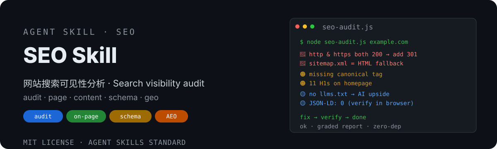

# SEO Skill 🔍

<div align="center">
  <strong>🇨🇳 中文</strong> | <a href="README.en.md">🌐 English</a>
</div>

<p align="center">
  
</p>

> 网站搜索可见性分析与优化技能——诊断 SEO 问题，输出可执行修复，直接帮网站落地。
> SEO analysis & optimization skill — audit technical SEO, on-page, content quality, structured data and AI-search visibility, then implement fixes.


## 为什么需要它

网站排名上不去、流量下降、新页不被收录，原因通常很集中：robots/sitemap 缺失、http/https 并存、没有 canonical、H1 滥用、没有结构化数据、没被 AI 搜索引用。**但排查这些需要系统方法**，会遇到：

- ❌ **规范散落**：SEO 要点分散在几十篇文章/工具里，没有一份可执行的检查清单
- ❌ **只诊不治**：很多工具只报问题，不给「怎么修 + 怎么验证」
- ❌ **工具绑死**：只给某个 AI 工具用，换个工具（Claude Code → Codex → Cursor）就失效
- ❌ **反坑踩雷**：robots.txt 返回 HTML 假文件、schema 静态抓不到、裸域 DNS 缺失——没踩过的人会误判

这个技能提供**一份规范、五条流程、跨工具通用**：audit（全站审计）/ page（单页）/ content（内容质量）/ schema（结构化数据）/ geo（AI 搜索优化），每条按「检查清单 → 判定标准 → 修复方法 → 验证方式」四段式执行，并内置实战反坑。

## 特性

- 🔍 **audit 全站审计**：可爬性 & 索引 → 技术基础 → 页面优化 → 内容质量 → 权威外链，按 🔴🟠🟡 分级输出，每条含 Issue / Impact / Evidence / Fix / Verify 五要素
- 📄 **page 单页深度分析**：title / meta description / H1 结构 / 关键词分布 / 图片 alt / 内链，给出可直接粘贴的重写文案
- ✍️ **content 内容质量**：搜索意图判断、关键词研究（含 AI fan-out 法）、E-E-A-T 强化、关键词自相残杀排查
- 🧩 **schema 结构化数据**：JSON-LD 常用类型模板 + 浏览器检测反坑（静态抓取漏报 JS 注入）
- 🤖 **geo AI 搜索优化**：AEO/GEO——llms.txt、AI bot 名单与 robots 策略、pricing.md 代理可读定价、Princeton GEO 量化方法
- 🛠️ **零依赖审计脚本**：`scripts/seo-audit.js`（Node 18+ 内置 fetch/dns）——一条命令跑完 DNS / 301 / robots / sitemap / 首页标签检查并自动分级
- 🧰 **跨工具通用**：Agent Skills 开放标准——Claude Code / Codex / Cursor / Gemini CLI 等都能加载
- 🪶 **渐进式披露**：SKILL.md 主入口 <500 行，深度清单按需加载 references/，不烧上下文

## 安装

本仓库即技能包（Agent Skills 标准结构，SKILL.md 在根目录）。两种用法：

```bash
git clone https://github.com/dtsola/xiaoyaoclaw-seo-skill
```

**用法 A：放进网站仓库做项目级 SEO 规范（推荐）**
```bash
# 在网站仓库根目录：
mkdir -p .agents/skills
cp -r xiaoyaoclaw-seo-skill .agents/skills/xiaoyaoclaw-seo-skill   # 技能本体
cp xiaoyaoclaw-seo-skill/CLAUDE.md ./             # Claude Code 入口（一行指向 AGENTS.md）
cp xiaoyaoclaw-seo-skill/AGENTS.md ./             # Codex/Cursor 等读取
```

**用法 B：装进 AI 工具的技能目录（全局可用）**
```bash
# Claude Code → ~/.claude/skills/xiaoyaoclaw-seo-skill/
# Codex       → ~/.codex/skills/
# Cursor      → .cursor/rules/
# 其他工具    → 对应 Agent Skills 目录
```

> 技能是给**网站/编码工具**用的（Agent Skills 开放标准），无需安装到 OpenClaw 的 skills 目录。

## 使用

1. 把技能放到你的网站仓库（或工具技能目录）
2. 对你的 AI 工具说「**审计一下这个站的 SEO**」「**优化这篇文章的关键词**」「**为什么我的页面不被 AI 引用**」，技能会自动选择子流程：
   - `audit` — 全站体检（可爬性 / 索引 / CWV / on-page / E-E-A-T）
   - `page` — 指定 URL 单页深度分析
   - `content` — 内容质量与关键词方案
   - `schema` — 结构化数据检测 / 生成
   - `geo` — AI 搜索可见度优化（llms.txt / AI bot / pricing.md）
3. 输出分级问题清单 + 修复方法 + 验证方式；确认后直接改代码/配置

## 🚀 快速上手（三步）

### Step 1：安装 + 跑一次快检

```bash
git clone https://github.com/dtsola/xiaoyaoclaw-seo-skill
cd xiaoyaoclaw-seo-skill

# 零依赖快检：一条命令跑完 DNS / 301 / robots / sitemap / 首页标签
node scripts/seo-audit.js your-domain.com
```

输出示例（分级摘要）：

```
🔴 高危:
  • 裸域无 DNS A 记录 → DNS 控制台加 A 记录并 301 归一
  • http:// 返回 200 未 301 到 https → 服务器/CDN 配 301
🟠 中危:
  • 首页缺 canonical → 补自引用 canonical
  • 首页 11 个 H1 → 收敛为 1 个
🟡 优化:
  • llms.txt 缺失 → 补真实 llms.txt（AI 引用红利）
```

### Step 2：让 AI 深度审计

对你的 Claude Code / Codex 说：

> 用 seo 技能审计一下本站，输出 🔴🟠🟡 分级问题清单

工具自动读取 SKILL.md → 按路由表选 `audit` → 加载 references/technical-seo.md 深度清单 → 浏览器渲染抓页 → 输出五要素报告。

### Step 3：落地修复 + 验证

每条问题都有修复方法（按技术栈给：Next.js / Halo / 静态站）和验证方式（curl 状态码 / Rich Results Test / PageSpeed / GSC 覆盖率）。

## 日常使用习惯

| 场景 | 动作 |
|---|---|
| 新站上线前 | 跑 `audit` 全站体检，先清 🔴 |
| 流量下降 / 排名消失 | `audit` 优先查可爬性与索引（robots/sitemap/canonical） |
| 单页不收录 | `page` 深度分析该 URL |
| 写新内容 | `content` 先定意图 + 关键词，再动笔 |
| 要富媒体摘要 | `schema` 生成 JSON-LD（Article/FAQ/Product） |
| 想被 ChatGPT/Perplexity 引用 | `geo`：llms.txt + AI bot 放行 + 首段定义句 + FAQ |
| 卖产品/服务 | `geo` 顺带生成 `/pricing.md`（AI 采购代理可读） |

## 与其他 SEO 方案的区别

| | 零散教程/工具 | marketingskills seo-audit | claude-seo（487 文件） | **SEO Skill（本技能）** |
|---|---|---|---|---|
| 规范系统性 | ❌ 散 | ✅ 完整 | ✅ 完整 | ✅ 完整 |
| 运行时依赖 | — | 轻 | ⚠️ Python/Chromium 重 | ✅ 零依赖（Node 18+） |
| 按需加载 | — | references | 子技能 | ✅ references/ 渐进披露 |
| 中文支持 | — | 英文为主 | 英文为主 | ✅ 中文为主（术语保英文） |
| 实战反坑 | — | 有 | 有 | ✅ 含三站实测反坑（HTML fallback / schema 静态漏报） |
| 跨工具 | — | Claude 系 | Claude 系 | ✅ Agent Skills 标准全兼容 |
| AI 搜索优化 | — | ai-seo 独立技能 | 有 | ✅ geo 子流程内置（含 pricing.md） |

## 目录结构

```
xiaoyaoclaw-seo-skill/
├── SKILL.md                    # 技能本体（入口 + 路由表 + 5 子流程核心）
├── AGENTS.md                   # 跨工具入口（Codex/Cursor/Gemini CLI 等读取）
├── CLAUDE.md                   # Claude Code 入口（一行指向 AGENTS.md）
├── README.md                   # 本文件
├── references/                 # 按需加载的深度清单
│   ├── technical-seo.md        # audit：robots/sitemap/canonical/CWV/国际 SEO/反模式
│   ├── on-page.md              # page：title/meta/H1/图片/内链
│   ├── content-quality.md      # content：意图/E-E-A-T/关键词定向
│   ├── schema.md               # schema：JSON-LD 模板 + 检测反坑
│   └── ai-seo.md               # geo：AI bot/llms.txt/pricing.md/AEO
├── scripts/
│   └── seo-audit.js            # 零依赖审计脚本（Node 18+，自动分级）
├── assets/
│   ├── readme/                 # README 资产（hero.svg / 群二维码）
│   └── examples/               # 落地示例（三站 llms.txt / robots 模板 / JSON-LD）
└── LICENSE
```

## License

MIT — 随便用，署名可选。

---

## 🛠️ 需要定制？

**Agent & Skills 定制，价格 ¥800 起。**

- 微信：`dtsola`（添加好友时备注：**openclaw定制**）
- 服务范围：网站 SEO 落地 / OpenClaw 多 agent 部署 / 自定义 Skill 开发 / agent 记忆系统搭建

## 💬 加入交流群

小遥全系产品用户交流群——产品反馈 · 使用交流 · 功能建议：

<p align="center">
  
</p>

<p align="center">扫码加群，或添加微信 <code>dtsola</code>（备注：<b>加群</b>）</p>

## 姊妹项目

- 🏠 **xiaoyaoclaw-workspace-initializer**（工作区初始化器）：给每个 agent 一个「家」——标准目录结构 + WORKSPACE.md 规范 + 多 agent 配置安全。<https://github.com/dtsola/xiaoyaoclaw-workspace-initializer>
- 🧠 **xiaoyaoclaw-memory-distill**（记忆蒸馏）：把对话蒸馏成结构化记忆——语义分级（核心→MEMORY.md / 日常→日志）+ 首次建忆 + 增量去重 + 敏感跳过。<https://github.com/dtsola/xiaoyaoclaw-memory-distill>
- 🗂️ **xiaoyaoclaw-task-progress-tracker**（任务进度跟踪器）：目录即容器，PROGRESS.md 即进度——tasks/ 与 projects/ 生命周期管理（状态 + 进度日志 + 文档索引）。<https://github.com/dtsola/xiaoyaoclaw-task-progress-tracker>
- 📚 **xiaoyaoclaw-kb-retriever**（知识库检索器）：本地知识库检索——分层 data_structure.md 索引导航 + 渐进式检索（md/pdf/xlsx），零依赖零 API key，Windows / macOS 双平台。<https://github.com/dtsola/xiaoyaoclaw-kb-retriever>
- 🩹 **xiaoyaoclaw-workspace-auditor**（工作区体检）：只读审计 5 类健康度 + 分级报告 + 修复建议，零依赖脚本永不改文件。<https://github.com/dtsola/xiaoyaoclaw-workspace-auditor>
- 📎 **xiaoyaoclaw-web-clipper**（网页剪藏）：把任意网页保存为带 frontmatter 的本地 Markdown——双引擎正文提取（readability + trafilatura 降级链）、中文文件名安全、批量剪藏 + 去重；输出直通 knowledge/clippings/，配合 kb-retriever 建索引即可检索。<https://github.com/dtsola/xiaoyaoclaw-web-clipper>
- 🤝 **xiaoyaoclaw-agent-orchestrator**（Agent 协作编排，**协作层**）：拆任务、分 agent、管进度、聚结果、失败重试。<https://github.com/dtsola/xiaoyaoclaw-agent-orchestrator>
- 📊 **xiaoyaoclaw-usage-report**（用量报告）：解析 session JSONL，回答「每次 agent 任务花了多久、用了哪些工具/技能/模型、消耗了多少 token」——零依赖纯本地，token 为主指标。<https://github.com/dtsola/xiaoyaoclaw-usage-report>
- 🎛️ **xiaoyaoclaw-commander**（OpenClaw Cross-Tool Commander，**指挥层**）：让任意支持 Agent Skills 的工具指挥小遥Claw / OpenClaw 多 agent 系统。<https://github.com/dtsola/xiaoyaoclaw-commander>
